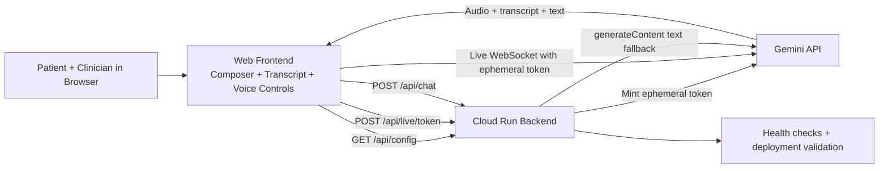

## Inspiration
Remote physiotherapy is growing, but first appointments still depend on long, subjective video calls and free-text notes that are easy to miss or forget.

We were inspired by research on AI-driven virtual rehab assistants and by the Gemini Live Agent Challenge vision of "beyond the text box" multimodal agents that see, hear, and speak in real time.

## What it does
Gemini Physio Intake Copilot is a live voice agent that joins a virtual physio session to guide the intake conversation with the patient.
It asks structured questions about pain history and function, listens to the patient's answers, optionally observes simple movements over video, and generates a concise, standardized intake summary for the physiotherapist.

## How we built it
We used the Gemini Live API and the Google GenAI SDK to create a low-latency audio interaction loop between the browser and Gemini.

The current prototype is a single Cloud Run service that:

- Serves the web UI
- Proxies text chat requests through a backend API
- Publishes runtime config to the browser
- Mints short-lived Gemini Live ephemeral tokens so the browser can open a secure Live session without a long-lived API key in the client

## Architecture

This design is optimized for the Gemini Live Agent Challenge in the Live Agents category.

### Objective

Build a live, multimodal physiotherapy intake copilot that can:

- Listen to patients in real time
- Speak naturally in short interruptible turns
- Optionally observe simple movement checks over video
- Produce a structured intake summary for clinician review

### High-Level Components

- Web frontend for patient and clinician session UI
- Gemini Live API session layer for real-time voice interaction
- Cloud Run backend for secure token issuance, runtime config, and text fallback/chat endpoints
- Observability layer for deployment checks and runtime health validation

### Architecture Diagram



### Runtime Flow

1. Browser loads runtime config from the Cloud Run backend.
2. On deployed environments, the frontend requests a short-lived Gemini Live ephemeral token from `/api/live/token`.
3. Browser opens a Gemini Live session with that token and streams push-to-talk audio.
4. Gemini returns audio and transcription updates to the UI.
5. If Live is unavailable, the backend text endpoint can still handle typed intake turns.
6. At session end, the UI generates a structured clinician-facing summary for review.

### Safety and Guardrails

- Decision-support only and no autonomous diagnosis claims
- Explicit red-flag escalation language
- Concise, confirmatory responses to reduce misunderstanding
- Prompt boundaries to avoid unsupported medical advice

## Challenges we ran into
Designing prompts that feel natural for patients but still capture all the clinically relevant intake details was harder than expected.

We also had to tune the live interaction so that the agent feels interruptible and responsive, avoiding long monologues or awkward pauses while still producing a clean summary for the physio.

## Accomplishments that we're proud of
We created an MVP where a physiotherapist can invite the agent into a call, let it run most of the intake, and receive a clear, structured summary within seconds of ending the conversation.

The agent already highlights potential red flags and suggests next-step assessment ideas, turning a free-form chat into a clinically useful starting point without replacing professional judgment. The deployed prototype now also uses short-lived Gemini Live ephemeral tokens, which lets the browser establish a secure Live session without exposing a long-lived API key client-side.

## What we learned
We learned how powerful multimodal, always-on agents can be for healthcare workflows when they are carefully scoped as decision support rather than automated diagnosis.

We also discovered that small UX details, like when the agent speaks, how it confirms understanding, and how summaries are formatted, matter as much as the underlying model quality.

## What's next
Next, we want to add real-time video frame streaming for simple movement checks, integrate session persistence for transcripts and summaries, and let clinicians customize intake templates for different body regions and conditions.

We also plan to improve session-state UX around secure Live connection startup, run pilot tests with physiotherapists, and validate how useful the summary output is in real workflows.

## Hackathon Assets

- Deployment guide: [deployment/DEPLOYMENT.MD](deployment/DEPLOYMENT.MD)

## Live Session UI Preview

The prototype includes a Gemini-style single-page live session mockup in [live-session-preview/index.html](live-session-preview/index.html).

Quick preview options:

1. Open [live-session-preview/index.html](live-session-preview/index.html) directly in your browser.
2. Or run a local static server from the repo root:

```bash
python -m http.server 5500
```

Then open: `http://localhost:5500/live-session-preview/`

For current deployment details and Gemini Live test instructions, see [deployment/DEPLOYMENT.MD](deployment/DEPLOYMENT.MD).
